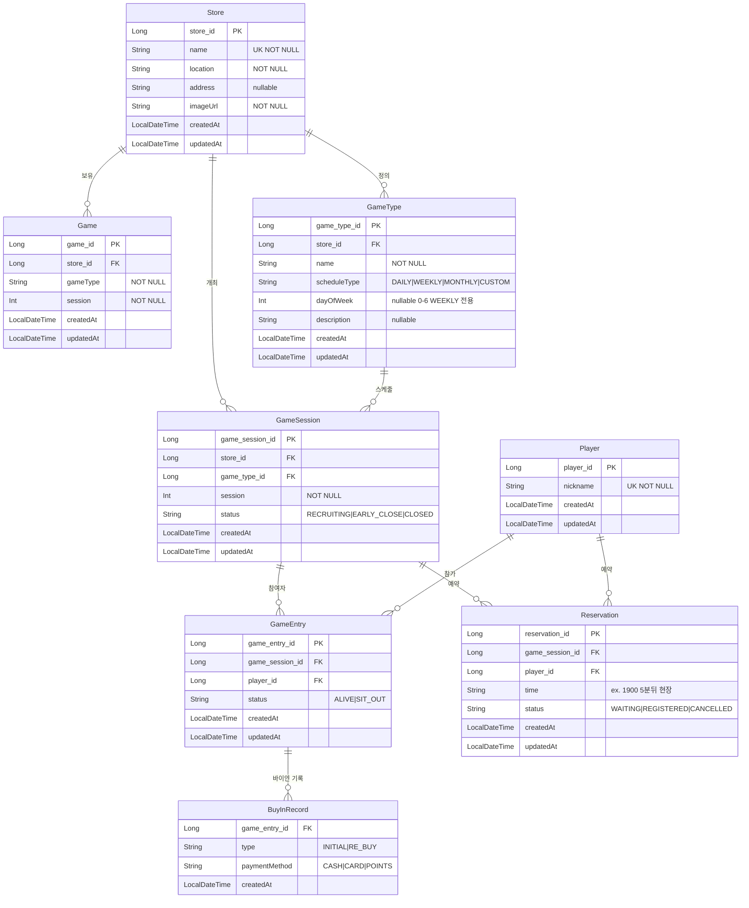
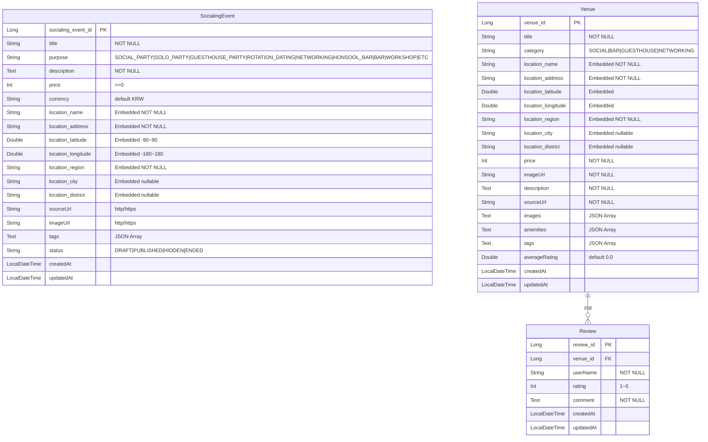
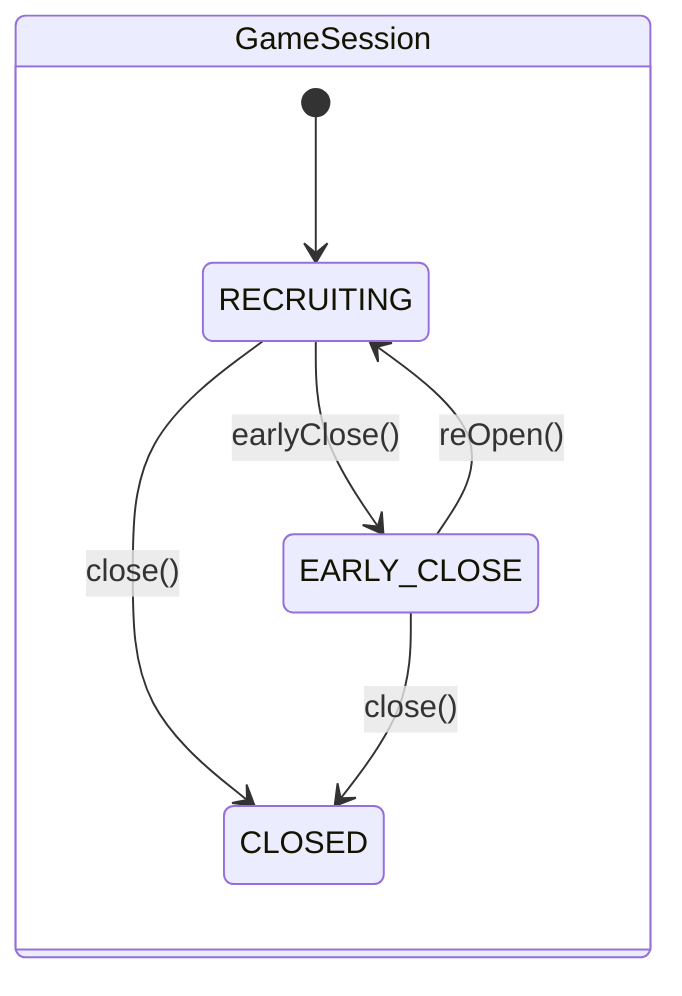
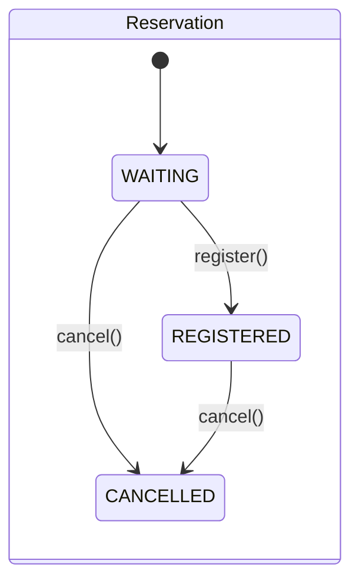
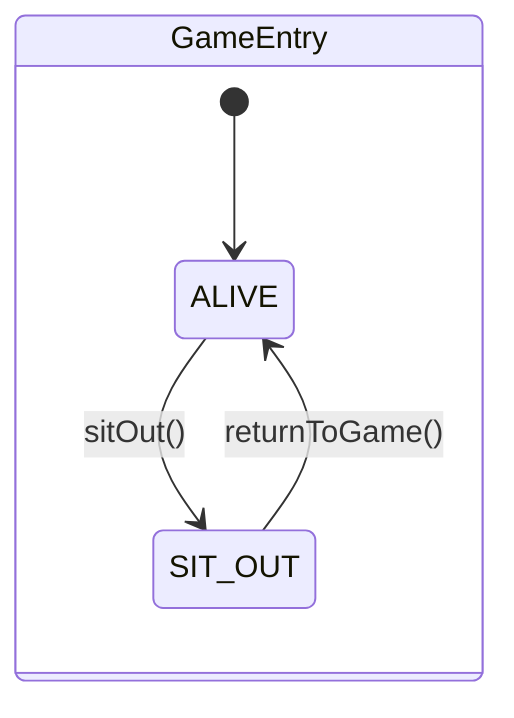
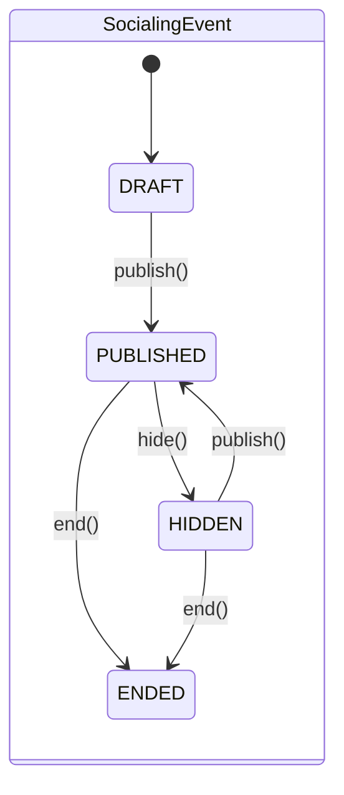
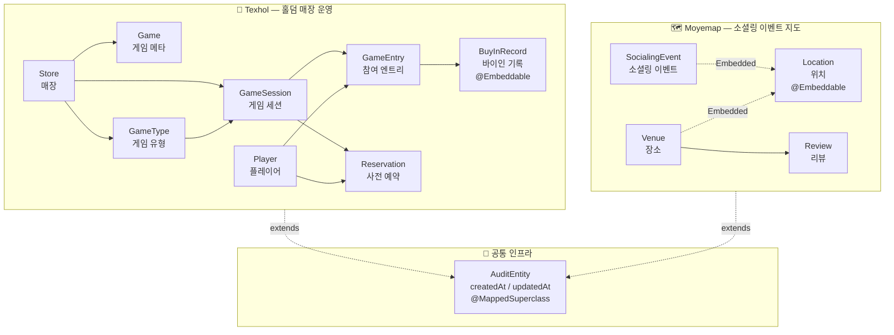

# Entity Diagram

## Texhol — 홀덤 매장 운영

---

## Moyemap — 소셜링 이벤트 지도

---

## 상태 머신 (State Machines)

---

## 전체 구조 요약

---

## 유니크 제약 (Unique Constraints)

| 테이블 | 유니크 키 | 설명 |
|---|---|---|
| `stores` | `name` | 매장명 중복 불가 |
| `players` | `nickname` | 닉네임 중복 불가 |
| `games` | `(store_id, game_type, session)` | 매장·유형·회차 조합 |
| `game_types` | `(store_id, name)` | 매장 내 게임 유형명 |
| `game_sessions` | `(store_id, game_type_id, session)` | 매장·유형·회차 조합 |
| `game_entries` | `(game_session_id, player_id)` | 세션 내 플레이어 중복 참가 불가 |
| `reservations` | `(game_session_id, player_id)` | 세션 내 플레이어 중복 예약 불가 |

## 인덱스 (Indexes)

| 테이블 | 인덱스 컬럼 | 목적 |
|---|---|---|
| `game_sessions` | `(store_id, status)` | 매장별 진행 중 세션 조회 |
| `game_sessions` | `game_type_id` | 게임 유형별 세션 조회 |
| `game_entries` | `player_id` | 플레이어별 참가 이력 조회 |
| `reservations` | `player_id` | 플레이어별 예약 조회 |
| `moyemap_socialing_events` | `status` | 게시된 이벤트 필터 |
| `moyemap_socialing_events` | `purpose` | 목적별 필터 |
| `moyemap_socialing_events` | `location_region` | 지역 필터 |
| `moyemap_socialing_events` | `price` | 가격 필터 |
| `moyemap_socialing_events` | `(location_latitude, location_longitude)` | 지도 범위 조회 |
| `venues` | `category` | 카테고리 필터 |
| `venues` | `location_region` | 지역 필터 |
| `venues` | `average_rating` | 평점 정렬 |
| `reviews` | `venue_id` | 장소별 리뷰 조회 |
| `reviews` | `rating` | 평점 필터 |
